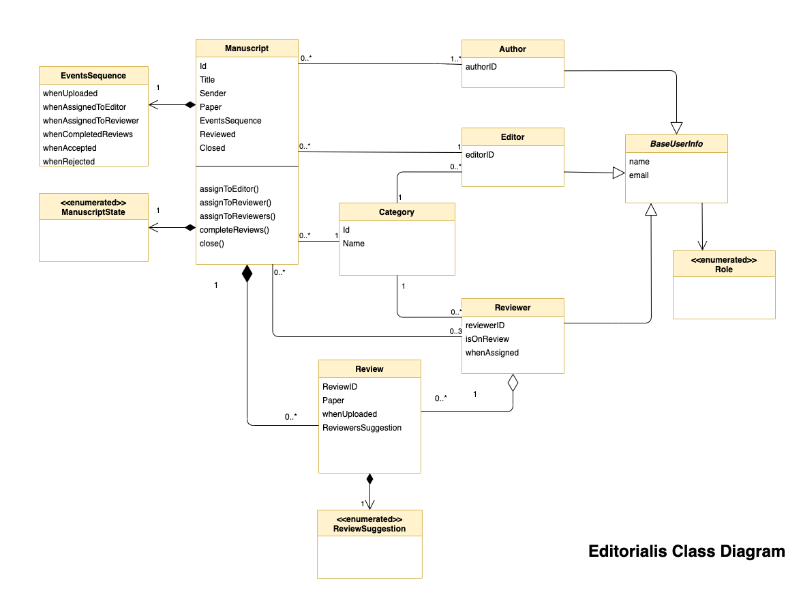

# Software Requirements Specification

---

<!-- TOC depthFrom:1 depthTo:6 withLinks:1 updateOnSave:1 orderedList:0 -->

- [Software Requirements Specification](#software-requirements-specification)
	- [Introduction](#introduction)
		- [Purpose](#purpose)
		- [Intended Audience](#intended-audience)
	- [Overall description](#overall-description)
		- [Product perspective](#product-perspective)
		- [Class diagram](#class-diagram)
		- [User classes and characteristics](#user-classes-and-characteristics)
	- [What this app is not about](#what-this-app-is-not-about)

<!-- /TOC -->
---

## Introduction

### Purpose

The purpose of this document is to build an online system, web app, to manage submitted manuscripts.

### Intended Audience

This project is useful for the manuscript publication houses. Users of the system are editors, authors, reviewers and admins.

## Overall description

### Product perspective

A database stores the following information.

**User details:**

Name, email, phone number, password, town and country, roles, publication category, avatar or photo, status (reviewer).

**Manuscript details:**

Title, authors, category, submission time, assignment time, status, tags, pdf file, doc file.

**Review details:**

Author, related manuscript, time assigned, submission time, reviewers suggestion, pdf file.

### Class diagram

### User classes and characteristics

**Admin**

Users with role admin would be able to:

- add or remove categories
- assign roles to users
- activate or deactivate users

**Editors:**

Users with role editor would be able to:

- view submitted articles within their scope
- view manuscripts status, manuscripts&#39; reviews
- reject manuscript if requirements are not met on one-click (aims and scope of the journal, manuscript type, length and format)
- assign articles for review, will have auto pre-populated list of available reviewers
- accept or reject articles based on reviews
- ask for third opinion

**Reviewers:**

Users with role reviewer would be able to:

- view manuscripts assigned to them
- submit reviews
- view previously submitted reviews

**Authors:**

Users with role author would be able to:

- submit new manuscript
- view previously submitted manuscripts and their status.

**Unregistered users:**

New users would be able to create new account. Author's role will be automatically assigned.

## What this app is not about

The system does not provide access to manuscripts to subscribers.

Once the manuscript was accepted for publication, the file is no longer accessible. Only details related to editorial work (information about authors, title, dates, reviews, status) are available.

## Typical manuscript publication process    

An image above shows a real life example of manuscript publication process.
For this project though I will simplify the process, please see image below, just enough to meet the requirements of the assignment.

 Implemented will be only the functionalities of an Editor . Plus possibility to upload/download a file.
 Editor will be able to
 - assign manuscript for review
 - make decision based on reviews  

Manuscript status changes will be emailed to author, editor, board of directors.
